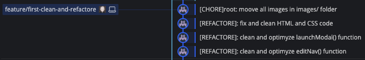
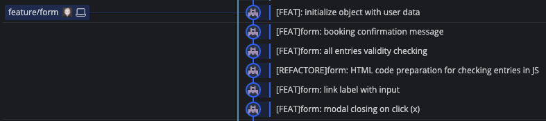
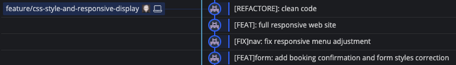
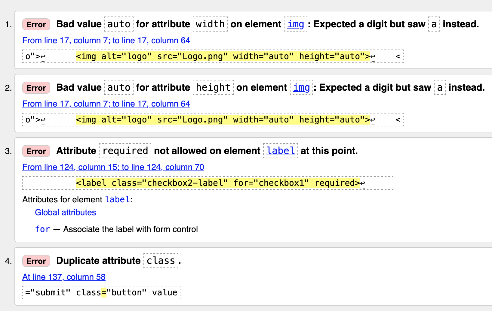
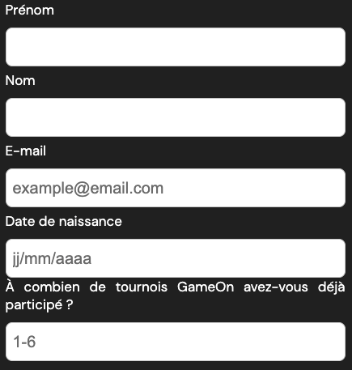
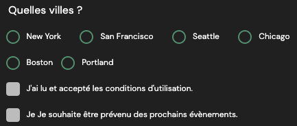

# 1. GameOne

Projet N°4 du parcours _Développeur Front-End_ [OpenClassrooms](https://openclassrooms.com/fr/).


L'intégration du site a été réalisée en HTML5, CSS3 et JavaScript sans Framework.

- [1. GameOne](#1-gameone)
  - [1.1. Timeline et découpage des tâches](#11-timeline-et-découpage-des-tâches)
    - [1.1.1. Branche de préparation](#111-branche-de-préparation)
    - [1.1.2. Branche dédiée au développement du formulaire](#112-branche-dédiée-au-développement-du-formulaire)
    - [1.1.3. Branche dédiée à la mise en page et au responsive](#113-branche-dédiée-à-la-mise-en-page-et-au-responsive)
  - [1.2. Correction et refactorisation](#12-correction-et-refactorisation)
    - [1.2.1. Refactorisation de la fonction 'editNav()'](#121-refactorisation-de-la-fonction-editnav)
    - [1.2.2. Refactorisation de la fonction 'launchModal()'](#122-refactorisation-de-la-fonction-launchmodal)
    - [1.2.3. Correction du code _HTML_ et _CSS_](#123-correction-du-code-html-et-css)
  - [1.3. Développement du formulaire](#13-développement-du-formulaire)
    - [1.3.1. Fermeture de la modal sur (x)](#131-fermeture-de-la-modal-sur-x)
    - [1.3.2. Liaison des `<label>` et `<input>`](#132-liaison-des-label-et-input)
    - [1.3.3. Conformité de la saisie utilisateur](#133-conformité-de-la-saisie-utilisateur)
      - [1.3.3.1. Préparation du code _HTML_](#1331-préparation-du-code-html)
      - [1.3.3.2. Logique du code JavaScript](#1332-logique-du-code-javascript)
        - [1.3.3.2.1. Les champs de type 'text'](#13321-les-champs-de-type-text)
        - [1.3.3.2.2. Les champs de type 'select'](#13322-les-champs-de-type-select)
        - [1.3.3.2.3. Validation du formulaire](#13323-validation-du-formulaire)
  - [1.4. Mise à disposition des données](#14-mise-à-disposition-des-données)
  - [1.5. v1.0.0](#15-v100)

***

## 1.1. Timeline et découpage des tâches

Le projet à été initialisé avec _Git-Flow_.  
Les tâches ont été réparties en trois branches de travail.

### 1.1.1. Branche de préparation



### 1.1.2. Branche dédiée au développement du formulaire



### 1.1.3. Branche dédiée à la mise en page et au responsive



***

##  1.2. Correction et refactorisation

### 1.2.1. Refactorisation de la fonction 'editNav()'

Nous pouvons constater dans le code HTML ci-dessous :

```html
<a href="javascript:void(0);" class="icon" onclick="editNav()">
  <i class="fa fa-bars"></i>
</a>
```

Comme indiqué dans la documentation [_MDN Web Docs_](https://developer.mozilla.org/fr/docs/Web/JavaScript/Reference/Operators/void), l'utilisateur `void` employé ici pour annuler le comportement par défaut de la balise `<a>` n'est pas une bonne pratique.  
Nous préfererons appeler une fonction dans un documet _JavaScript_ en utilisant les gestionnaires d'évenements et ainsi ne pas mélanger les langages.

```js
function editNav() {
  var x = document.getElementById('myTopnav');
  if (x.className === 'topnav') {
    x.className += ' responsive';
  } else {
    x.className = 'topnav';
  }
}
```

- Pour assurer la cohérence de la fonction, `var` peut être remplacée par `const`, car l'élément désigné ici par son ID est en lecture seul.
- Le nom de la variable 'x' est peu explicite.
- Un commentaire expliquant le rôle de la fonction semble nécessaire.
- Cette fonction devant être toujours active, sans être appelé, peut-être anonyme et auto-inviquée.

Ci-dessous, le code _JavaScript_ refactorisé et commenté :

```js
/**
 * @name IDontReallyExist
 * @function 
 * Gère l'affichage et le déploiement du menu responsive au click sur l'icône 
 * (visible à 768px max).
 */
(() => {
  const btnMenu = document.querySelector('a.icon');
  const navigation = document.getElementById('myTopnav');
  btnMenu.addEventListener('click', () => {
    if (navigation.className === 'topnav') {
      navigation.className += ' responsive';
    } else {
      navigation.className = 'topnav';
    }
  })
})();
```

Et le code _HTML_ nettoyé :

```html
<a href="#" class="icon">
  <i class="fa fa-bars"></i>
</a>
```

### 1.2.2. Refactorisation de la fonction 'launchModal()'

Fonction non commentée et non optimisée :

```js
// DOM Elements
const modalbg = document.querySelector('.bground');
const modalBtn = document.querySelectorAll('.modal-btn');
const formData = document.querySelectorAll('.formData');

// launch modal event
modalBtn.forEach((btn) => btn.addEventListener('click', launchModal));

// launch modal form
function launchModal() {
  modalbg.style.display = 'block';
}
```

Fonction commentée et optimisée :  
(cette fonction devant être aussi toujours active, nous la rendrons anonyme et auto-inviquée)

```js
/**
 * @name IDontReallyExist
 * @function 
 * - Ouvre le formulaire au click sur le boutton 'je M'inscris'.
 */
(() => {
  const modalBtn = document.querySelectorAll('.modal-btn');
  modalBtn.forEach((btn) => {
    btn.addEventListener('click', () => modalbg.style.display = 'block')});
})();
```

Avec la constante `modalbg` en tête de document car réutilisée dans le code :

```js
// DOM Elements
const modalbg = document.querySelector('.bground');
```

### 1.2.3. Correction du code _HTML_ et _CSS_

Les erreurs relevées ci-dessous lors de la validation [_W3C_](https://validator.w3.org) ont été corrigées :



Autres corrections :  

- Une `</div>` fermante orpheline a été supprimée.
- De nombreuses balises `<br>` inutiles ont été supprimées.
- La déclaration `<html lang="en">` corrigée en `<html lang="fr">`.
- `background-image: url("background.png");` dans ***modal.css*** ne concerne aucune image existante.

***

## 1.3. Développement du formulaire

### 1.3.1. Fermeture de la modal sur (x)

Fonction demeurant active et qui passera la modal en `display: none;`.  
Déclenchement au 'click' par le gestionnaire d'évennement sur le noeud `<span>` de classe `.close`. 

```js
/**
 * @name IDontReallyExist
 * @function 
 * Ferme le formulaire au click sur (x).
 */
(() => {
  const modalCloseBtn = document.querySelector('span.close');
  modalCloseBtn.addEventListener('click', () => modalbg.style.display = 'none');
})();
```

### 1.3.2. Liaison des `<label>` et `<input>`

Un attribut `for` est présent sur tous les `<label>` et est de même valeur que l'`id` de l'`<input>` auquel il est lié.  

Exemple :

```html
<input class="checkbox-input" type="checkbox" id="checkbox1" checked>
<label class="checkbox2-label" for="checkbox1"></label>
```

Dans le code ci-dessus concernant les conditions d'utilisation, l'attribut `checked` sera retiré car l'utilisateur doit cocher cette case lui-même attestant ainsi en avoir pris connaissance.

### 1.3.3. Conformité de la saisie utilisateur

#### 1.3.3.1. Préparation du code _HTML_

Ayant choisi l'hypothèse d'une gestion _Back-end_ en _JavaScript_, le code _HTML_ a été allegé en supprimant de la balise `<form>` les attributs :
- name="reserve" 
- action="index.html" 
- method="get"
  
L'attribut `novalidate` a éte ajouté afin de prendre le contrôle des messages d'erreur à la place du navigateur.

```html
<form novalidate></form>
```

Tout formatage de type _minlength_ ou _min_ etc... sera retiré des 6 premiers champs ainsi que les `type` pour assurer la conformité de la saisie utilisateur en _JavaScript_ grâce a des _regEx_ dédiées :

```js
const regExpName = /^([A-Za-zéèêëîï]{2,15})([\-\s]?)([A-Za-zéèêëîï]{0,15})$/;
const regExpMail = /^([A-Za-z0-9\-\.]+)@([A-Za-z0-9\-]+)\.([a-z]{2,3})$/;
const regExpDate = /^([0-9]{2})\/([0-9]{2})\/([0-9]{4})$/;
const regExpNumber = /^[1-6]{1}$/;
```

Les attributs `name` seront enlevés car inutiles pour une gestion _Back-end_ en _JavaScript_.  
L'utilisateur sera guidé dans sa saisie par des `placeholder` pour les champs 'e-mail', 'date de naissance' et 'nombre de participations'.  
Chaque `<div>` de classe `.formData` aura un `id` afin d'assurer le ciblage des éléments en _JavaScript_.  

Exemple avec le champ du nombre de participations :

```html
<div class="formData" id="numberOfTournament">
  <label for="quantity">À combien de tournois GameOn avez-vous déjà participé ?</label>
  <input class="text-control" id="quantity" placeholder="1-6">
</div>
```

Pour le choix de la ville et les conditions d'utilisation, deux `<div>` de classe `.error-message` seront positionnées différement afin de recevoir un message d'erreur personnalisé respectant le formatage précédent (le code _HTML_ étant un peu différent pour ces deux champs).

#### 1.3.3.2. Logique du code JavaScript

##### 1.3.3.2.1. Les champs de type 'text'



Les cinq premiers champs (de type texte) sont contrôlés aux changement de focus par la fonction `changeFocusTextValidity()`.  
Cette fonction prend en argument :
- le noeud `<input>` à écouter.
- l'expression régulière qui sera comparée à la saisie utilisateur.
- le message d'erreur préalablement défini et qui sera affiché en cas d'erreur.

La fonction `submitTextValidity()` contrôlera pour ces mêmes `<input>` que les champs ne sont pas laissé vides par utilisateur lors de la soumission du formulaire.  
Si non vide, les données sont stockées en `localStorage`.  
note : _Des données erronées peuvent être temporairement stockées, mais ceci est sans effet car dans ce cas, le formulaire ne passerai pas la validation et les données ne seraient pas envoyées_.  

Cette fonction prend en argument :
- le noeud `<input>` à écouter.
- le message d'erreur préalablement défini et qui sera affiché en cas d'erreur.
- une chaine de caractère qui correspondra à la clé pour le stockage en `localStorage`. 


##### 1.3.3.2.2. Les champs de type 'select'



Pour ce type de champ, les fonctions `checkCitySelect()`, `termOfUse()` et `newsLetter()` surveilleront l'état `checked` de ces `<input>` à la soumission du formulaire.

##### 1.3.3.2.3. Validation du formulaire

A chaque saisie correct, un attribut `data-error-visible="false"` est injecté à la `<div>` parente de l'`<input>` écoutée.  
A la soumission du formulaire, la fonction `goodAnswer()` compte le nombre d'attributs 'correct'.  
Si les sept entrées obligatoires sont valides, nous autorisons alors l'envoi du formulaire.

```js
/**
 * @name goodAnswer
 * @function
 * Compte le nombre d'entrées valides saisies par l'utilisateur.
 * @return  {number} retourne le nombre d'entrées valides saisies par l'utilisateur.
 */
const goodAnswer = () => {
  const allEntry = document.querySelectorAll('.formData[data-error-visible="false"]');
  let i = 0;
  allEntry.forEach(() => i += 1);
  return i;
};

/**
 * @name validationAndConfirmation
 * @function
 * - Ferme le formulaire si toutes les entrées sont correct.
 * - Affiche la confirmation de réservation.
 */
const validationAndConfirmation = () => {
  submitForm.addEventListener('click', () => {
    if (goodAnswer() === 7) {
      modalbg.style.display = 'none';
      bookingConfirmation();
    }
  })
};
```

***

## 1.4. Mise à disposition des données

A la fin du fichier ***modal.js***, les données utilisateurs sont rassemblées dans un objet et mises à disposition du _Back-end_.  
Un affichage dans la console est aussi prévu pour vérification.

```js
// dataForBackEnd
const userData = {
  firstName: localStorage.getItem('firstName'),
  lastName: localStorage.getItem('lastName'),
  eMail: localStorage.getItem('eMail'),
  birthDate: localStorage.getItem('birthDate'),
  quantity: localStorage.getItem('quantity'),
  city: localStorage.getItem('city'),
  newsLetter: localStorage.getItem('newsLetter')
};

// displayUserData
(() => {
  for (let property in userData) {
    console.log(`${property}: ${userData[property]}`);
  }
})();
```

***

## 1.5. v1.0.0

Après la rédaction du [***DOC.md***](./DOC.md) :  
Publication de la _release_ `v1.0.0` sur la branche _master_.

***

_**End**_